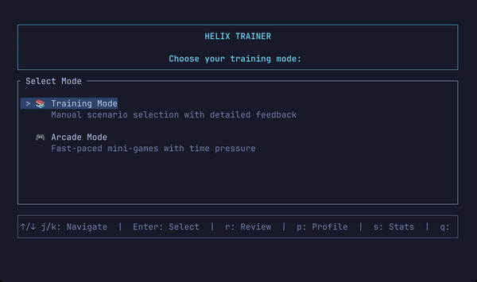
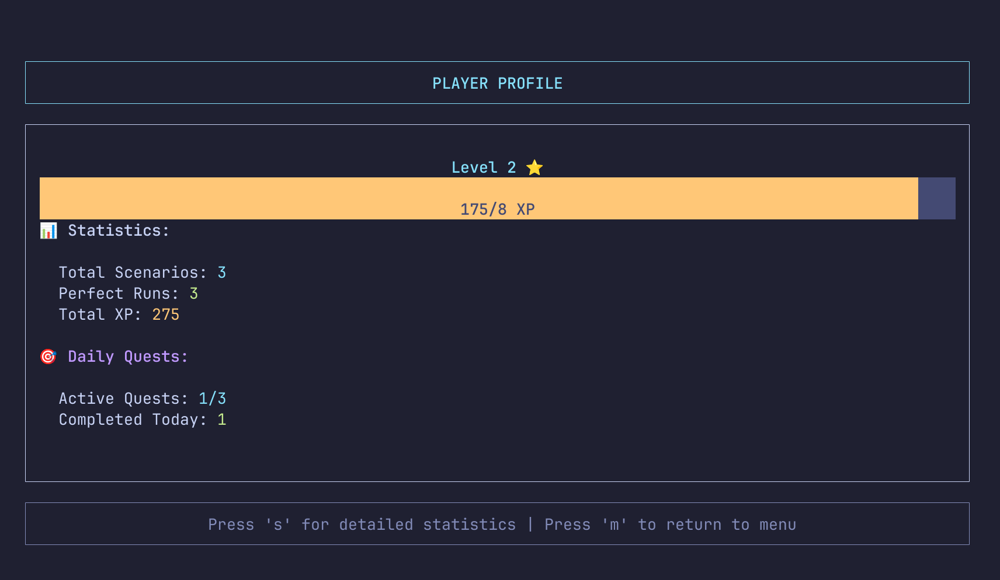
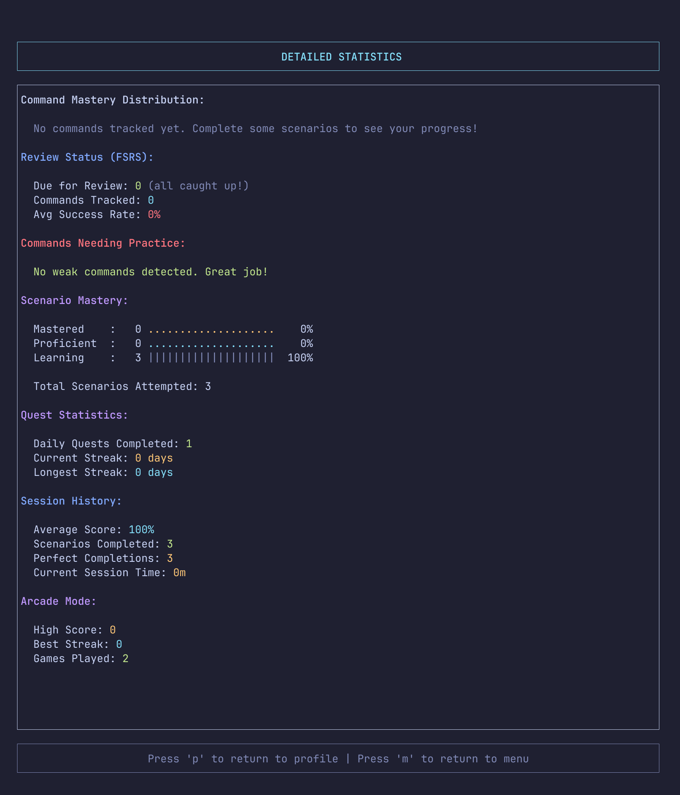
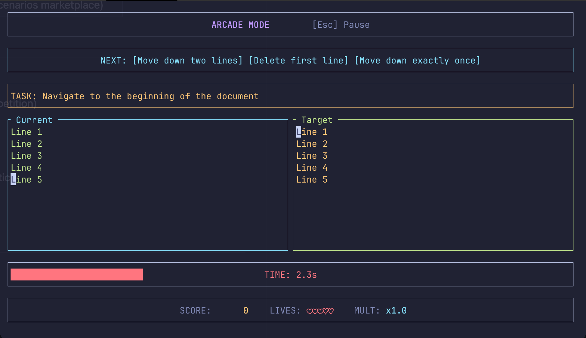
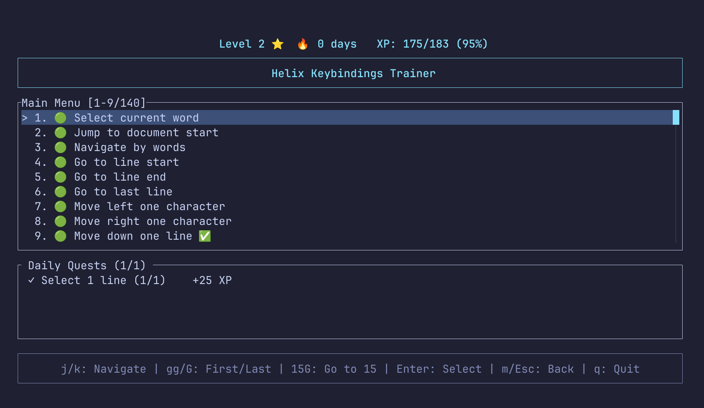

# Helix Trainer

[](https://github.com/bug-ops/helix-trainer/actions)
[](https://codecov.io/github/bug-ops/helix-trainer)
[](LICENSE)
[](https://www.rust-lang.org)
[](https://github.com/bug-ops/helix-trainer/releases/latest)
[](https://github.com/rust-secure-code/safety-dance/)

**Master Helix editor keybindings through scientifically-optimized spaced repetition and gamified training.**

Stop learning commands in isolation. Train real development workflows with FSRS-powered spaced repetition (20-30% faster mastery), daily quests, XP progression, and anti-farming mechanics that ensure genuine skill development.



> [!IMPORTANT]
> **100% Offline & Privacy-First** — No internet required, no telemetry, no cloud sync. All data stays on your machine in `~/.config/helix-trainer/`

## Features

### Smart Learning System

- **FSRS Spaced Repetition** — 20-30% fewer reviews than traditional methods (research-proven)
- **Interactive Review Sessions** — Practice due commands with instant feedback and XP rewards
- **Scenario Mastery Tracking** — Three-tier progression (Learning → Proficient → Mastered) with graduated XP scaling
- **Daily Quest System** — Duolingo-style challenges with streak tracking
- **Anti-Farming Protection** — Session penalties prevent XP exploitation
- **Profile & Statistics** — Track your progress, view mastery levels, and see performance analytics





### Game Modes



Three distinct game modes for varied training experiences:

- **Arcade Mode** — 60-second timed sessions with 3 lives and streak multipliers up to 5x
- **Survival Mode** — One life, escalating difficulty, endless challenge until you fail
- **Daily Challenge** — Fixed daily scenarios with consistent difficulty for fair competition

All modes feature:

- **FSRS-Powered Selection** — Prioritizes scenarios with commands you need to practice
- **Audio Feedback** — Sound effects for correct/incorrect answers and game events (toggle with M key)
- **Streak Multiplier** — Build combos for consecutive completions
- **XP Integration** — Per-scenario XP awards with streak bonuses
- **Pause & Resume** — Access profile/stats mid-game

### Training Features



- **Smart Scenario Discovery** — Filter by category, difficulty, commands, or completion status with 6 sort modes
- **Rich Metadata** — Every scenario tagged with category, difficulty, taught commands, and practice focus
- **Syntax Highlighting** — Realistic Rust code snippets with proper highlighting
- **Real Helix Accuracy** — Uses official `helix-core` library (v25.07.1)
- **95+ Commands** — Movement, editing, clipboard, undo/redo, repeat, surround, text objects, multi-cursor, registers, macros
- **160 Training Scenarios** — From basics to intermediate workflows with difficulty indicators
- **70 Daily Quests** — Easy, medium, and hard challenges across all commands
- **100% Offline** — No cloud, no tracking, all data stays local (`~/.config/helix-trainer/`)
- **Arrow Key Navigation** — Optional `enable_arrow_keys_in_normal_mode` configuration for cursor movement
- **Custom Keymap Support** — Optional `use_helix_keymap` configuration trains against your own Helix `config.toml` remaps instead of the stock keymap (gameplay only — see [Custom Helix keymap](#custom-helix-keymap-optional))

## Installation

> [!NOTE]
> **Requirements**: Terminal with Unicode support. No additional dependencies needed for pre-built binaries.

### Pre-built binaries (recommended)

#### Install script

Downloads the right archive for your platform, verifies its SHA-256 checksum, and installs the binary:

```bash
# Linux/macOS — installs to ~/.local/bin
LATEST_TAG=$(curl -fsSLI -o /dev/null -w '%{url_effective}' https://github.com/bug-ops/helix-trainer/releases/latest | sed 's#.*/tag/##')
(T="$(mktemp)" && trap 'rm -f "$T"' EXIT && curl -fsSL "https://raw.githubusercontent.com/bug-ops/helix-trainer/${LATEST_TAG}/scripts/install.sh" -o "$T" && sh "$T")
```

```powershell
# Windows — installs to %LOCALAPPDATA%\helix-trainer\bin
$ErrorActionPreference = "Stop"
$latest = (irm https://api.github.com/repos/bug-ops/helix-trainer/releases/latest).tag_name
$installScript = Join-Path ([System.IO.Path]::GetTempPath()) ([System.IO.Path]::GetRandomFileName())
irm "https://raw.githubusercontent.com/bug-ops/helix-trainer/$latest/scripts/install.ps1" -OutFile $installScript
& $installScript
Remove-Item $installScript
```

Both one-liners resolve and pin to the latest release tag before fetching the script, instead of fetching from the mutable `main` branch ref; download it to a freshly-generated temp file before running it, so a failed download aborts instead of silently running nothing; and use `mktemp`/`GetRandomFileName()` rather than a fixed, predictable path, which in a world-writable directory like `/tmp` could otherwise be pre-planted as a symlink to overwrite an unrelated file.

Pin a specific version or install directory:

```bash
./scripts/install.sh --version 0.6.1 --dir /usr/local/bin
./scripts/install.sh --static   # Linux: static musl build, no audio feature
```

> [!TIP]
> Review any install script before piping it into a shell. Read [`scripts/install.sh`](scripts/install.sh) / [`scripts/install.ps1`](scripts/install.ps1), or download and run it locally instead of piping from `curl`/`irm`.

#### Manual download

Download for your platform from [**Releases**](https://github.com/bug-ops/helix-trainer/releases/latest):

| Platform | Architecture | Archive |
|----------|--------------|---------|
| Linux | x86_64 | `helix-trainer-*-x86_64-unknown-linux-gnu.tar.gz` |
| Linux | x86_64 (static) | `helix-trainer-*-x86_64-unknown-linux-musl.tar.gz` |
| Linux | ARM64 | `helix-trainer-*-aarch64-unknown-linux-gnu.tar.gz` |
| Linux | ARM64 (static) | `helix-trainer-*-aarch64-unknown-linux-musl.tar.gz` |
| macOS | Apple Silicon | `helix-trainer-*-aarch64-apple-darwin.tar.gz` |
| macOS | Intel | `helix-trainer-*-x86_64-apple-darwin.tar.gz` |
| Windows | x86_64 | `helix-trainer-*-x86_64-pc-windows-msvc.zip` |
| Windows | ARM64 | `helix-trainer-*-aarch64-pc-windows-msvc.zip` |

Extract and run:

```bash
# Linux/macOS
tar -xzf helix-trainer-*.tar.gz
cd helix-trainer-*/
./helix-trainer

# Windows: extract .zip and run helix-trainer.exe
```

> [!TIP]
> Verify checksums with `sha256sum -c helix-trainer-*.sha256`

### Build from source

> [!WARNING]
> **Requires Rust 1.98+** (2024 edition). Install via [rustup.rs](https://rustup.rs/)

```bash
git clone https://github.com/bug-ops/helix-trainer.git
cd helix-trainer
cargo build --release
./target/release/helix-trainer
```

## Quick start

```bash
helix-trainer
```

> [!TIP]
> **First time?** Start with Daily Quests! The system intelligently selects scenarios based on your current skill level and schedules reviews using FSRS spaced repetition.

The interactive TUI guides you through:

1. **Training Mode** — Manual scenario selection with detailed feedback
2. **Arcade Mode** — Fast-paced mini-games with time pressure
3. **Daily Quests** — Fresh challenges every day
4. **Progress Tracking** — XP, levels, streaks, mastery progression
5. **Performance Analytics** — Review calendar, mastery stats

### Example training session

```text
Mode Selection
├─ Training Mode
│  ├─ Daily Quests (3 active)
│  │  ├─ ✅ Practice: Complete 3 scenarios
│  │  ├─ ⏳ Learning: Try 2 new scenarios
│  │  └─ 🔄 Review: 5 cards due
│  ├─ Scenario List (160 available)
│  │  ├─ Basic Movement (Mastered - 20% XP)
│  │  ├─ Word Navigation (Proficient - 50% XP)
│  │  └─ Delete Line (Learning - 100% XP)
│  └─ Profile / Statistics
└─ Arcade Mode
   ├─ 🎮 Arcade (60s, 3 lives)
   ├─ 💀 Survival (1 life, endless)
   └─ 📅 Daily Challenge
```

## Commands supported

| Category | Commands |
|----------|----------|
| **Movement** | <kbd>h</kbd> <kbd>j</kbd> <kbd>k</kbd> <kbd>l</kbd> <kbd>w</kbd> <kbd>b</kbd> <kbd>e</kbd> <kbd>W</kbd> <kbd>B</kbd> <kbd>E</kbd> <kbd>0</kbd> <kbd>$</kbd> <kbd>^</kbd> <kbd>gg</kbd> <kbd>ge</kbd> <kbd>gh</kbd> <kbd>gl</kbd> <kbd>gs</kbd> <kbd>[p</kbd> <kbd>]p</kbd> <kbd>Ctrl</kbd>+<kbd>b</kbd>/<kbd>f</kbd>/<kbd>u</kbd>/<kbd>d</kbd> |
| **Find/Till** | <kbd>f</kbd> <kbd>F</kbd> <kbd>t</kbd> <kbd>T</kbd> <kbd>Alt</kbd>+<kbd>.</kbd> |
| **Match Mode** | <kbd>mm</kbd> (brackets) <kbd>ms</kbd> (surround) <kbd>md</kbd> (delete surround) <kbd>mr</kbd> (replace surround) |
| **Text Objects** | <kbd>ma</kbd>/<kbd>mi</kbd> + <kbd>w</kbd> <kbd>W</kbd> <kbd>(</kbd> <kbd>[</kbd> <kbd>{</kbd> <kbd><</kbd> <kbd>"</kbd> <kbd>'</kbd> <kbd>`</kbd> <kbd>p</kbd> |
| **Selection** | <kbd>x</kbd> <kbd>X</kbd> <kbd>v</kbd> <kbd>;</kbd> <kbd>,</kbd> <kbd>Alt</kbd>+<kbd>,</kbd> <kbd>%</kbd> <kbd>s</kbd> <kbd>S</kbd> <kbd>Alt</kbd>+<kbd>s</kbd> <kbd>Alt</kbd>+<kbd>;</kbd> <kbd>&</kbd> <kbd>_</kbd> <kbd>Alt</kbd>+<kbd>-</kbd> <kbd>Alt</kbd>+<kbd>_</kbd> <kbd>C</kbd> <kbd>Alt</kbd>+<kbd>C</kbd> <kbd>K</kbd> <kbd>Alt</kbd>+<kbd>K</kbd> |
| **Editing** | <kbd>i</kbd> <kbd>a</kbd> <kbd>I</kbd> <kbd>A</kbd> <kbd>o</kbd> <kbd>O</kbd> <kbd>r</kbd> <kbd>c</kbd> <kbd>Alt</kbd>+<kbd>c</kbd> <kbd>d</kbd> <kbd>Alt</kbd>+<kbd>d</kbd> <kbd>J</kbd> <kbd>Alt</kbd>+<kbd>J</kbd> <kbd>></kbd> <kbd><</kbd> <kbd>~</kbd> <kbd>`</kbd> <kbd>Alt</kbd>+<kbd>`</kbd> <kbd>R</kbd> <kbd>Alt</kbd>+<kbd>x</kbd> <kbd>Ctrl</kbd>+<kbd>c</kbd> (toggle comment) |
| **Clipboard** | <kbd>y</kbd> <kbd>p</kbd> <kbd>P</kbd> |
| **Registers** | <kbd>"</kbd><kbd>a</kbd>-<kbd>z</kbd> prefix on <kbd>y</kbd>/<kbd>p</kbd>/<kbd>P</kbd>/<kbd>R</kbd>/<kbd>d</kbd>/<kbd>c</kbd> (named registers) <kbd>"</kbd><kbd>_</kbd> (blackhole, discards writes) |
| **Macros** | <kbd>q</kbd> (record/stop) <kbd>Q</kbd> (replay) |
| **Command-line** | <kbd>:</kbd> then <kbd>goto N</kbd> / <kbd>g N</kbd> (jump to line) |
| **Search** | <kbd>/</kbd> <kbd>?</kbd> <kbd>n</kbd> <kbd>N</kbd> <kbd>*</kbd> <kbd>Alt</kbd>+<kbd>*</kbd> |
| **View** | <kbd>z</kbd> <kbd>zz</kbd> <kbd>zt</kbd> <kbd>zb</kbd> <kbd>zm</kbd> <kbd>zj</kbd> <kbd>zk</kbd> |
| **Undo/Redo** | <kbd>u</kbd> <kbd>U</kbd> <kbd>Ctrl</kbd>+<kbd>r</kbd> |
| **Repeat** | <kbd>.</kbd> (repeat last action) |
| **Count Prefix** | <kbd>3h</kbd> <kbd>5j</kbd> <kbd>2w</kbd> (execute N times) |
| **Insert Mode** | Text input, <kbd>Backspace</kbd>, arrow keys, <kbd>Esc</kbd> |
| **Arrow Keys** *(optional)* | <kbd>←</kbd> <kbd>→</kbd> <kbd>↑</kbd> <kbd>↓</kbd> for cursor movement in Normal mode via `enable_arrow_keys_in_normal_mode` |

All commands powered by `helix-core` v25.07.1 for 100% accuracy.

### Custom Helix keymap (optional)

If you've remapped keys in your own Helix `config.toml`, the trainer can train against *your* bindings instead of the stock ones. Opt in by setting `use_helix_keymap: true` in `~/.config/helix-trainer/config.json`:

```json
{
  "config": {
    "use_helix_keymap": true
  }
}
```

When enabled, the trainer reads `~/.config/helix/config.toml` (the same file Helix itself reads) at startup and translates your gameplay keypresses through it — `[keys.normal]` remaps, plus nested `[keys.normal.g]`/`[keys.normal.m]`/`[keys.normal.z]`/`[keys.normal.[]`/`[keys.normal.]]` minor-mode remaps. Unsupported forms (key sequences, `@`-macros, `:`-typable commands, minor-mode relocation to a different prefix) are reported via a startup notification rather than silently ignored.

This is **gameplay-only**: menus, results, filter screens, and scenario hint prose always use the stock keymap (`j`/`k`/`gg`), even with a custom keymap active, since remapping trainer UI chrome would break the canonical command identity FSRS review history depends on. A malformed config, a missing file, or an oversized/excessive config falls back to the stock keymap without blocking startup.

A handful of keys are reserved by the trainer's own UI and intercepted before gameplay dispatch, so remapping onto them has no effect: <kbd>F1</kbd>, <kbd>?</kbd>, <kbd>Shift</kbd>+<kbd>/</kbd>, and <kbd>Ctrl</kbd>+<kbd>Q</kbd> everywhere; in Arcade mode, also <kbd>Esc</kbd>, <kbd>q</kbd>, <kbd>m</kbd>, <kbd>p</kbd>, <kbd>s</kbd>, <kbd>a</kbd>, and <kbd>M</kbd> while paused or on the game-over screen.

#### macOS Terminal.app and other non-kitty terminals

The Option-composed <kbd>Alt</kbd>+<kbd>s</kbd> chord is unreachable on macOS terminals that don't implement the [kitty keyboard protocol](https://sw.kovidgoyal.net/kitty/keyboard-protocol/) (Terminal.app is the common case). This is an accepted trade-off, not a bug: the same physical key also types a plain, directly-typeable character on other keyboard layouts (e.g. `ß` on German QWERTZ), and a `KeyEvent` alone can't tell the two apart, so the trainer no longer guesses. (`Alt-c` (`change_selection_noyank`) has the same Terminal.app reachability gap and the same remap workaround described below.)

Two ways around it:

- Switch to a kitty-protocol-capable terminal (Kitty, WezTerm, Ghostty, iTerm2 with the beta protocol enabled), or enable "Use Option as Meta key" in your terminal's settings if it offers one.
- Remap the affected command to a key your terminal delivers unambiguously, using the custom keymap above. For example, to reach `split_selection_on_newline` (bound to `Alt-s`) via <kbd>Ctrl</kbd>+<kbd>y</kbd> instead:

  ```toml
  [keys.normal]
  "C-y" = "split_selection_on_newline"
  ```

  The trainer resolves the command name to the same canonical `Alt-s` a real keystroke would produce, so this completes any scenario that asks for `Alt-s`. Since this is the same `config.toml` real Helix reads, the remap also applies inside Helix itself — pick a key that isn't already meaningful to you there; `C-y` is unbound upstream, unlike e.g. `C-s` (`save_selection`).

## Why this project exists

**Traditional editor tutorials teach commands. Real development requires workflows.**

Most Helix tutorials:

- Teach <kbd>x</kbd><kbd>d</kbd> (delete line) in isolation
- Show <kbd>w</kbd> (next word) on synthetic text
- Stop at "congratulations, you know the basics!"

**Real development requires:**

- Navigate to failing test → jump to implementation → fix bug → stage changes → commit
- Refactor function across 3 files using LSP
- Debug by jumping between error logs and source code

**Helix Trainer bridges this gap** through:

### Scientifically-optimized learning (FSRS)

- **20-30% fewer reviews** than traditional spaced repetition
- **99.6% better accuracy** than older algorithms (tested on 350M+ reviews)
- **Identifies YOUR weaknesses** and schedules smart practice
- Same algorithm as Anki 23.10+ (research-proven)

### Scenario mastery system

Prevents XP farming while ensuring genuine skill development:

- **Three-tier progression**: Learning (100% XP) → Proficient (50% XP) → Mastered (20% XP)
- **Session spam protection**: Same-day penalties (100% → 70% → 30%)
- **Bounded tracking**: 10,000 scenario limit with validation
- **Performance benchmarks**: <1ms XP calculations, ~288 bytes per scenario

### Gamification that works

Duolingo-proven mechanics:

- **Daily quests** with fresh challenges
- **Streak tracking** with loss aversion
- **XP & levels** (exponential scaling)
- **Achievements** for milestones

### Privacy-first architecture

- No cloud services, no internet required
- All data stored locally (`~/.config/helix-trainer/`)
- No telemetry, tracking, or data collection
- Your learning stays on your machine

## Technology stack

| Component | Library |
|-----------|---------|
| **TUI Framework** | [ratatui](https://ratatui.rs/) |
| **Terminal I/O** | [crossterm](https://github.com/crossterm-rs/crossterm) |
| **Async Runtime** | [tokio](https://tokio.rs/) |
| **Editor Core** | [helix-core](https://github.com/helix-editor/helix) |
| **Spaced Repetition** | [fsrs](https://crates.io/crates/fsrs) |
| **Audio** | [rodio](https://github.com/RustAudio/rodio) |
| **Syntax Highlighting** | [syntect](https://github.com/trishume/syntect) |
| **Large Text** | [tui-big-text](https://crates.io/crates/tui-big-text) |

## Contributing

Contributions welcome! See [CONTRIBUTING.md](CONTRIBUTING.md) for:

- Development setup and workflow
- Code standards and quality checks
- Pull request process
- Testing requirements

> [!CAUTION]
> **Zero-Tolerance Quality Standards**: All PRs must pass clippy (with `-D warnings`), tests, and formatting checks. CI enforces these automatically.

**Quick contributor setup**:

```bash
git clone https://github.com/bug-ops/helix-trainer.git
cd helix-trainer

cargo +nightly fmt
cargo nextest run
cargo clippy --all-targets --all-features -- -D warnings
cargo build --release
```

## Documentation

- [CHANGELOG.md](CHANGELOG.md) — Release history and version notes
- [CONTRIBUTING.md](CONTRIBUTING.md) — Contribution guidelines
- [SECURITY.md](SECURITY.md) — Security policy

## FAQ

<details>
<summary><b>Why not just use <code>:tutor</code> in Helix?</b></summary>

`:tutor` is excellent for one-time learning. Helix Trainer adds:

- Spaced repetition for long-term retention
- Gamification for daily habit formation
- Progress tracking and analytics
- Multiple game modes for varied practice

They're complementary tools, not competitors.
</details>

<details>
<summary><b>Why FSRS instead of traditional spaced repetition?</b></summary>

FSRS is 20-30% more efficient (research-proven on 350M+ reviews). It's the same algorithm Anki switched to in v23.10+. We use the best available learning science.
</details>

<details>
<summary><b>Can I use this offline?</b></summary>

Yes, 100% offline. No internet required, all data local, zero telemetry.
</details>

<details>
<summary><b>Is this only for Helix?</b></summary>

Yes, Helix-specific. While many commands have similar names, Helix uses a different selection-first model. This trainer is designed specifically for Helix editor workflows.
</details>

<details>
<summary><b>How do I toggle sound on/off?</b></summary>

Press <kbd>M</kbd> on the mode selection screen to toggle audio feedback. Sound settings persist across sessions.
</details>

## Acknowledgments

- [Helix Editor](https://helix-editor.com/) — For the amazing modal editor
- [Ratatui](https://ratatui.rs/) — For the excellent TUI framework
- [FSRS Research Team](https://github.com/open-spaced-repetition) — For the algorithm
- [Anki](https://apps.ankiweb.net/) — Inspiration for spaced repetition
- [Kenney.nl](https://kenney.nl/) — For CC0 sound effects

Inspired by Helix's built-in `:tutor` and decades of learning science research.

## License

Licensed under MIT — see [LICENSE](LICENSE) for details.
