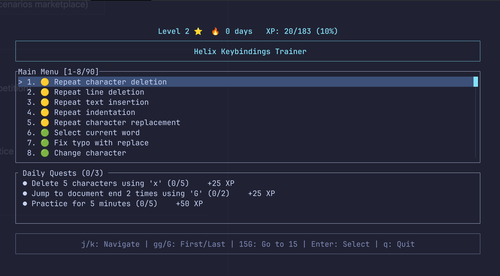

# Helix Trainer

[](https://github.com/bug-ops/helix-trainer/actions)
[](https://codecov.io/github/bug-ops/helix-trainer)
[](LICENSE)
[](https://www.rust-lang.org)
[](https://github.com/bug-ops/helix-trainer/releases/latest)
[](https://github.com/rust-secure-code/safety-dance/)

**Master Helix editor keybindings through scientifically-optimized spaced repetition and gamified training.**

Stop learning commands in isolation. Train real development workflows with FSRS-powered spaced repetition (20-30% faster mastery), daily quests, XP progression, and anti-farming mechanics that ensure genuine skill development.



> [!IMPORTANT]
> **100% Offline & Privacy-First** — No internet required, no telemetry, no cloud sync. All data stays on your machine in `~/.config/helix-trainer/`

## Features

### Smart Learning System

- **FSRS Spaced Repetition** — 20-30% fewer reviews than traditional methods (research-proven)
- **Interactive Review Sessions** — Practice due commands with instant feedback and XP rewards
- **Scenario Mastery Tracking** — Three-tier progression (Learning → Proficient → Mastered) with graduated XP scaling
- **Daily Quest System** — Duolingo-style challenges with streak tracking
- **Anti-Farming Protection** — Session penalties prevent XP exploitation
- **Profile & Statistics** — Track your progress, view mastery levels, and see performance analytics


### Mini-Games Mode


- **Arcade Training** — 60-second timed sessions with automatic scenario progression
- **Streak Multiplier** — Build combos up to 5x for consecutive completions
- **Lives System** — Start with 3 lives, earn bonus lives at score milestones
- **XP Integration** — Per-scenario XP awards with streak bonuses
- **Pause & Resume** — Access profile/stats mid-game

### Training Features

- **Smart Scenario Discovery** — Filter by category, difficulty, commands, or completion status with 6 sort modes
- **Rich Metadata** — Every scenario tagged with category, difficulty, taught commands, and practice focus
- **Real Helix Accuracy** — Uses official `helix-core` library (v25.07.1)
- **45+ Commands** — Movement, editing, clipboard, undo/redo, repeat
- **136 Training Scenarios** — From basics to intermediate workflows with difficulty indicators
- **55 Daily Quests** — Easy, medium, and hard challenges across all commands
- **100% Offline** — No cloud, no tracking, all data stays local (`~/.config/helix-trainer/`)

## Installation

> [!NOTE]
> **Requirements**: Terminal with Unicode support. No additional dependencies needed for pre-built binaries.

### Pre-built Binaries (Recommended)

Download for your platform from [**Releases**](https://github.com/bug-ops/helix-trainer/releases/latest):

| Platform | Architecture | Archive |
|----------|--------------|---------|
| Linux | x86_64 | `helix-trainer-*-x86_64-unknown-linux-gnu.tar.gz` |
| Linux | x86_64 (static) | `helix-trainer-*-x86_64-unknown-linux-musl.tar.gz` |
| Linux | ARM64 | `helix-trainer-*-aarch64-unknown-linux-gnu.tar.gz` |
| Linux | ARM64 (static) | `helix-trainer-*-aarch64-unknown-linux-musl.tar.gz` |
| macOS | Apple Silicon | `helix-trainer-*-aarch64-apple-darwin.tar.gz` |
| macOS | Intel | `helix-trainer-*-x86_64-apple-darwin.tar.gz` |
| Windows | x86_64 | `helix-trainer-*-x86_64-pc-windows-msvc.zip` |
| Windows | ARM64 | `helix-trainer-*-aarch64-pc-windows-msvc.zip` |

Extract and run:

```bash
# Linux/macOS
tar -xzf helix-trainer-*.tar.gz
cd helix-trainer-*/
./helix-trainer

# Windows: extract .zip and run helix-trainer.exe
```

> [!TIP]
> Verify checksums with `sha256sum -c helix-trainer-*.sha256`

### Build from Source

> [!WARNING]
> **Requires Rust 1.85+** (2024 edition). Install via [rustup.rs](https://rustup.rs/)

```bash
git clone https://github.com/bug-ops/helix-trainer.git
cd helix-trainer
cargo build --release
./target/release/helix-trainer
```

## Quick Start

```bash
helix-trainer
```

> [!TIP]
> **First time?** Start with Daily Quests! The system intelligently selects scenarios based on your current skill level and schedules reviews using FSRS spaced repetition.

The interactive TUI will guide you through:

1. **Daily Quests** — Fresh challenges every day (Practice, Learning, Review)
2. **Training Scenarios** — 20 scenarios with instant feedback
3. **Progress Tracking** — XP, levels, streaks, mastery progression
4. **Performance Analytics** — Review calendar, mastery stats

### Example Training Session

```text
Main Menu
├─ Daily Quests (3 active)
│  ├─ ✅ Practice: Complete 3 scenarios
│  ├─ ⏳ Learning: Try 2 new scenarios
│  └─ 🔄 Review: 5 cards due
├─ Training Scenarios (20 available)
│  ├─ Basic Movement (Mastered - 20% XP)
│  ├─ Word Navigation (Proficient - 50% XP)
│  └─ Delete Line (Learning - 100% XP)
├─ Profile (Level 5, 842 XP)
└─ Statistics
```

## Commands Supported

| Category | Commands |
|----------|----------|
| **Movement** | <kbd>h</kbd> <kbd>j</kbd> <kbd>k</kbd> <kbd>l</kbd> <kbd>w</kbd> <kbd>b</kbd> <kbd>e</kbd> <kbd>0</kbd> <kbd>$</kbd> <kbd>gg</kbd> <kbd>ge</kbd> <kbd>gh</kbd> <kbd>gl</kbd> <kbd>gs</kbd> <kbd>[p</kbd> <kbd>]p</kbd> <kbd>^</kbd> |
| **Find/Till** | <kbd>f</kbd> <kbd>F</kbd> <kbd>t</kbd> <kbd>T</kbd> <kbd>Alt</kbd>+<kbd>.</kbd> |
| **Match Mode** | <kbd>mm</kbd> (brackets) <kbd>ms</kbd> (surround) <kbd>md</kbd> (delete surround) <kbd>mr</kbd> (replace surround) |
| **Text Objects** | <kbd>ma</kbd>/<kbd>mi</kbd> + <kbd>w</kbd> <kbd>W</kbd> <kbd>(</kbd> <kbd>[</kbd> <kbd>{</kbd> <kbd><</kbd> <kbd>"</kbd> <kbd>'</kbd> <kbd>`</kbd> <kbd>p</kbd> |
| **Selection** | <kbd>x</kbd> <kbd>X</kbd> <kbd>v</kbd> <kbd>;</kbd> <kbd>,</kbd> <kbd>%</kbd> <kbd>s</kbd> <kbd>S</kbd> <kbd>C</kbd> <kbd>K</kbd> |
| **Editing** | <kbd>i</kbd> <kbd>a</kbd> <kbd>I</kbd> <kbd>A</kbd> <kbd>o</kbd> <kbd>O</kbd> <kbd>r</kbd> <kbd>c</kbd> <kbd>d</kbd> <kbd>J</kbd> <kbd>></kbd> <kbd><</kbd> <kbd>~</kbd> <kbd>R</kbd> |
| **Clipboard** | <kbd>y</kbd> <kbd>p</kbd> <kbd>P</kbd> |
| **Search** | <kbd>/</kbd> <kbd>?</kbd> <kbd>n</kbd> <kbd>N</kbd> <kbd>*</kbd> <kbd>#</kbd> |
| **View** | <kbd>z</kbd> <kbd>zz</kbd> <kbd>zt</kbd> <kbd>zb</kbd> <kbd>zm</kbd> <kbd>zj</kbd> <kbd>zk</kbd> |
| **Undo/Redo** | <kbd>u</kbd> <kbd>U</kbd> |
| **Repeat** | <kbd>.</kbd> (repeat last action) |
| **Count Prefix** | <kbd>3h</kbd> <kbd>5j</kbd> <kbd>2w</kbd> (execute N times) |
| **Insert Mode** | Text input, <kbd>Backspace</kbd>, arrow keys, <kbd>Esc</kbd> |

All commands powered by `helix-core` v25.07.1 for 100% accuracy.

## Why This Project Exists

**Traditional editor tutorials teach commands. Real development requires workflows.**

Most Helix tutorials:

- Teach <kbd>x</kbd><kbd>d</kbd> (delete line) in isolation ❌
- Show <kbd>w</kbd> (next word) on synthetic text ❌
- Stop at "congratulations, you know the basics!" ❌

**Real development requires:**

- Navigate to failing test → jump to implementation → fix bug → stage changes → commit ✅
- Refactor function across 3 files using LSP ✅
- Debug by jumping between error logs and source code ✅

**Helix Trainer bridges this gap** through:

> [!IMPORTANT]
> **The Key Differentiator**: Phase 2 will introduce full workflow simulation with mock LSP and git state. No other editor trainer does this. We're building the foundation (habits, engagement) before the flagship feature.

### 1. Scientifically-Optimized Learning (FSRS)

- **20-30% fewer reviews** than traditional spaced repetition
- **99.6% better accuracy** than older algorithms (tested on 350M+ reviews)
- **Identifies YOUR weaknesses** and schedules smart practice
- Same algorithm as Anki 23.10+ (research-proven)

### 2. Scenario Mastery System

Prevents XP farming while ensuring genuine skill development:

- **Three-tier progression**: Learning (100% XP) → Proficient (50% XP) → Mastered (20% XP)
- **Session spam protection**: Same-day penalties (100% → 70% → 30%)
- **Bounded tracking**: 10,000 scenario limit with validation
- **Performance benchmarks**: <1ms XP calculations, ~288 bytes per scenario

### 3. Gamification That Works

Duolingo-proven mechanics:

- **Daily quests** with fresh challenges
- **Streak tracking** with loss aversion
- **XP & levels** (exponential scaling)
- **Achievements** for milestones

### 4. 100% Offline & Privacy-First

- No cloud services, no internet required
- All data stored locally (`~/.config/helix-trainer/`)
- No telemetry, tracking, or data collection
- Your learning stays on your machine

## Current Status

> [!NOTE]
> **Active Development**: Phase 2.2 complete! 136 scenarios with syntax highlighting, 1239+ passing tests, zero clippy warnings.

### Completed

| Phase | Version | Highlights |
|-------|---------|------------|
| **Phase 1** | v0.1.3 | FSRS spaced repetition, daily quests, XP/mastery system, anti-farming |
| **Phase 1.5** | v0.3.0 | Scenario metadata, filtering/sorting, categorized scenarios |
| **Phase 2.1** | v0.4.1 | Arcade mode (60s sessions, lives, streak multiplier, XP integration) |
| **Phase 4** | v0.5.0 | Typestate input system: surround commands (ms/mr/md), text objects (ma/mi) |
| **Phase 2.2** | v0.5.3 | Adaptive difficulty, syntax highlighting, 136 scenarios with realistic Rust code |

### 🔄 Phase 2.3: Mini-Games Polish (Planned)

- **Audio Feedback** — Sound effects with volume control
- **Local Leaderboards** — Track personal bests and high scores
- **New Game Modes** — Survival (endless), Challenge (daily puzzles)

### 🔄 Phase 3: Workflow Simulator (Planned)

The flagship feature that makes Helix Trainer unique:

- **Mock LSP Server** — Realistic goto-definition, find-references, rename scenarios
- **Git State Simulation** — Stage, commit, diff workflows without real repo
- **Multi-File Navigation** — Jump between related files in simulated projects
- **Real Workflows** — CI debugging, refactoring, code review scenarios

**Why this matters**: Bridges the tutorial → productivity gap that nobody else solves.

## Technology Stack

| Component | Library |
|-----------|---------|
| **TUI Framework** | [ratatui](https://ratatui.rs/) |
| **Terminal I/O** | [crossterm](https://github.com/crossterm-rs/crossterm) |
| **Async Runtime** | [tokio](https://tokio.rs/) |
| **Editor Core** | [helix-core](https://github.com/helix-editor/helix) |
| **Spaced Repetition** | [fsrs](https://crates.io/crates/fsrs) |
| **Large Text** | [tui-big-text](https://crates.io/crates/tui-big-text) |

## Contributing

Contributions welcome! See [CONTRIBUTING.md](CONTRIBUTING.md) for:

- Development setup and workflow
- Code standards and quality checks
- Pull request process
- Testing requirements

> [!CAUTION]
> **Zero-Tolerance Quality Standards**: All PRs must pass clippy (with `-D warnings`), tests, and formatting checks. CI enforces these automatically.

**Quick contributor setup**:

```bash
# Clone repository
git clone https://github.com/bug-ops/helix-trainer.git
cd helix-trainer

# Run quality checks before committing
cargo +nightly fmt
cargo nextest run
cargo clippy --all-targets --all-features -- -D warnings
cargo build --release
```

## Documentation

- [CHANGELOG.md](CHANGELOG.md) — Release history and version notes
- [CONTRIBUTING.md](CONTRIBUTING.md) — Contribution guidelines
- [SECURITY.md](SECURITY.md) — Security policy

## FAQ

<details>
<summary><b>Why not just use <code>:tutor</code> in Helix?</b></summary>

`:tutor` is excellent for one-time learning. Helix Trainer adds:

- Spaced repetition for long-term retention
- Gamification for daily habit formation
- Progress tracking and analytics
- (Phase 2) Full workflow training

They're complementary tools, not competitors.
</details>

<details>
<summary><b>Why FSRS instead of traditional spaced repetition?</b></summary>

FSRS is 20-30% more efficient (research-proven on 350M+ reviews). It's the same algorithm Anki switched to in v23.10+. We use the best available learning science.
</details>

<details>
<summary><b>Can I use this offline?</b></summary>

Yes, 100% offline. No internet required, all data local, zero telemetry.
</details>

<details>
<summary><b>When is Phase 2 (Workflow Simulator)?</b></summary>

After Phase 1 stabilizes (~3 months). We're building the foundation (habits, engagement) before the flagship feature.
</details>

<details>
<summary><b>Is this only for Helix?</b></summary>

Yes, Helix-specific. While many commands have similar names, Helix uses a different selection-first model. This trainer is designed specifically for Helix editor workflows.
</details>

## Roadmap

| Phase | Status | Focus |
|-------|:------:|-------|
| Phase A | ✅ | Foundation (30+ commands, 136 scenarios, TUI) |
| Phase 1 | ✅ | Smart learning (FSRS, quests, mastery) |
| Phase 2.1 | ✅ | Mini-Games mode (arcade, lives, streaks) |
| Typestate | ✅ | Input expansion (surround ms/mr/md, text objects ma/mi) |
| Phase 2.2 | ✅ | Adaptive difficulty, syntax highlighting, realistic scenarios |
| Phase 2.3 | 📋 | Mini-Games polish (sound, leaderboards) |
| Phase 3 | 📋 | Workflow simulator (LSP, git, multi-file) |
| Phase 4 | 💡 | Network effects (multiplayer, scenarios marketplace) |

## Acknowledgments

- [Helix Editor](https://helix-editor.com/) — For the amazing modal editor
- [Ratatui](https://ratatui.rs/) — For the excellent TUI framework
- [FSRS Research Team](https://github.com/open-spaced-repetition) — For the algorithm
- [Anki](https://apps.ankiweb.net/) — Inspiration for spaced repetition

Inspired by Helix's built-in `:tutor` and decades of learning science research.

## License

Licensed under MIT — see [LICENSE](LICENSE) for details.
