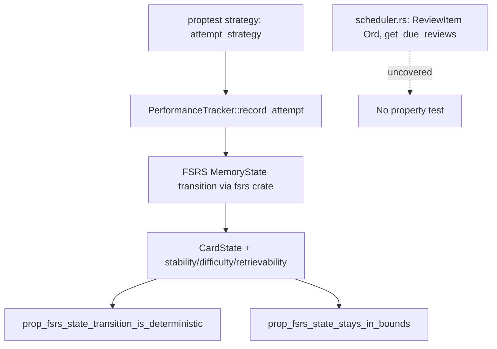

---
aliases:
  - FSRS Proptest Coverage Plan
tags:
  - sdd
  - plan
  - testing
  - learning-scheduler
  - status/implemented
created: 2026-08-09
status: implemented
related:
  - "[[spec]]"
  - "[[BRD]]"
  - "[[constitution]]"
---

# Technical Plan: FSRS Scheduler Property-Based Test Coverage Gap (As-Built)

> [!info] References
> **Spec**: [[spec]]
> This document is retroactive — it describes the architecture and testing
> approach actually implemented in commit `33bdaa1`, plus the residual work
> a future PR would need to complete the original finding's full scope.

## 1. Architecture

### Approach

No production architecture changed — this is test-only work confined to
`src/learning/performance.rs`'s existing `#[cfg(test)] mod tests` module.
Two `proptest!` blocks were added using inline tuple/range strategies
(no `prop_compose!` macros), driving the same public API
(`PerformanceTracker::record_attempt`) that existing example-based tests
already exercise — chosen over testing internal transition functions
directly, so the properties verify the same surface real callers use.

### Component Diagram



### Key Design Decisions

| Decision | Choice | Rationale | Alternatives Considered |
|----------|--------|-----------|------------------------|
| Where to add coverage | `performance.rs` only, not `scheduler.rs` | Unclear from the commit; the residual gap is not explained in the commit message or CHANGELOG | Full FR-001..005 coverage across both files, as originally drafted |
| Test surface | Public API (`record_attempt`) rather than internal transition function | Matches existing example-based test style in the same file; verifies the same contract callers depend on | Testing `update_fsrs_state`/internal transition helper directly |
| Clock handling | `FakeClock` fixed baseline + `advance_days` | Satisfies NFR-003 (determinism); consistent with existing test infrastructure in the module | Reading real `Utc::now()` (rejected — non-deterministic shrinking) |
| Case count | proptest default (256), no `ProptestConfig` override | Simplicity; no evidence CI time was a concern at review time | Explicit lower bound e.g. `cases = 64` for faster CI |

## 2. Project Structure

```
src/learning/
├── performance.rs      # PerformanceTracker, CardState — 2 new proptest! blocks
│                        # added to existing #[cfg(test)] mod tests
│                        # + custom deserializer for retrievability self-heal
└── scheduler.rs         # Scheduler, ReviewItem — UNCHANGED, still uncovered
```

## 3. Data Model

No new types. The bug fix added a custom deserializer for one existing field:

```rust
// src/learning/performance.rs (illustrative, as-built)
fn deserialize_retrievability<'de, D>(deserializer: D) -> Result<f32, D::Error>
where
    D: serde::Deserializer<'de>,
{
    let opt: Option<f32> = Option::deserialize(deserializer)?;
    Ok(opt.unwrap_or(1.0))
}
```

Applied via `#[serde(deserialize_with = "deserialize_retrievability")]` on
the `retrievability` field, so a previously-corrupted `null` value in an
existing `profile.json` self-heals to `1.0` on next load instead of failing
deserialization outright.

### Migrations

None — JSON persistence is schema-less at the file level; the deserializer
change is backward-compatible with both old (`null`-corrupted) and new
(valid float) profile files.

## 4. API Design

Not applicable — no new public API; both `proptest!` blocks are
`#[cfg(test)]`-only.

## 5. Integration Points

None — self-contained within `src/learning/performance.rs`'s test module.

## 6. Security

No change to `src/security.rs`. Not applicable.

## 7. Testing Strategy

| Level | Framework | What Is Tested | Coverage |
|-------|-----------|-----------------|----------|
| Property | `proptest` (default config, 256 cases) | FSRS state-transition determinism (`prop_fsrs_state_transition_is_deterministic`); FSRS bounds invariants (`prop_fsrs_state_stays_in_bounds`) | `performance.rs` only |
| Regression (example-based) | `#[test]` | `test_deserialize_null_retrievability_recovers_as_one` — locks in the self-heal behavior for the discovered bug | `performance.rs` |
| **Gap** | — | `ReviewItem` `Ord`/`PartialOrd` total-order property (FR-004); `get_due_reviews`/`get_review_queue` bounds property (FR-005); due-date-not-earlier-than-review property (FR-002) | **None — `scheduler.rs` untested by proptest** |

## 8. Performance Considerations

Two property blocks at 256 cases each add a small, bounded amount of CI
time; no explicit measurement was captured in the researched commit. If
`scheduler.rs` coverage is added later, the same default-config approach
should be re-evaluated against actual CI wall-clock impact before assuming
it is free.

## 9. Rollout Plan

Already shipped as part of commit `33bdaa1` (2026-08-09), merged via PR
#330. No feature flag or phased rollout — test-only change, immediately
active in CI on merge.

## 10. Constitution Compliance

| Principle | Status | Notes |
|-----------|--------|-------|
| III. Testing — proptest required for deterministic-given-fixed-inputs logic, if declared | Partially compliant | `performance.rs` now compliant; `scheduler.rs` (same subsystem, same "deterministic given fixed inputs" characterization) is not — see Residual Work below |
| III. Testing — no live wall-clock in property tests | Compliant | `FakeClock` used throughout |
| III. Testing — colocated `#[cfg(test)]` modules | Compliant | No new submodule introduced |
| VIII. Git Workflow — full check suite before commit | Assumed compliant (not independently re-verified as part of this retroactive plan) | — |

## 11. Residual Work

> [!warning] Recommended Follow-up (Not Yet Scheduled)
> To fully close the original finding's scope, a follow-up would need to add
> `proptest!` coverage to `src/learning/scheduler.rs` for:
> 1. `ReviewItem`'s `Ord`/`PartialOrd` — total order, transitivity, no panic
>    on `NaN`-adjacent `priority` values (FR-004)
> 2. `Scheduler::get_due_reviews`/`get_review_queue` — only `due <= now`
>    items returned, queue never exceeds its size limit (FR-005)
> 3. Optionally, a standalone due-date-not-earlier-than-review-timestamp
>    property in `performance.rs` (FR-002), even though the "correct by
>    construction" argument is plausible, to make the guarantee verified
>    rather than asserted
>
> This residual gap should be filed as its own finding/spec if pursued,
> rather than silently assumed closed by this record.

## 12. Bundled Unrelated Change

Commit `33bdaa1` also contains an unrelated CI-hardening fix (issue #295,
`src/gamification/storage.rs`, test-only): the previous approach to
simulating a save failure (`chmod 0555` on the temp directory) silently
no-ops under a root CI runner, since root ignores permission bits — making
`test_failed_save_does_not_corrupt_existing_profile` a false-positive pass.
The fix instead pre-creates a directory at the exact temp-file path
`ProfileStorage::save` will next use (predictable from `std::process::id()`
+ a suffix counter), so `fs::File::create` deterministically fails
regardless of privilege level. This is noted here for completeness since it
shares a commit with the FSRS work, but it is not part of this finding's
scope and required no separate spec.

## 13. Risks and Mitigations

| Risk | Impact | Probability | Mitigation |
|------|--------|-------------|------------|
| A future reader assumes `.claude/rules/continuous-improvement.md`'s proptest claim is fully backed, given this record exists | Wasted effort assuming `scheduler.rs` safety net exists when it does not | Medium | [[BRD#Residual Gap]] and this section's Residual Work explicitly flag the gap |
| `scheduler.rs` ships a real ordering/queue-bound bug that proptest would have caught | Incorrect due-review selection reaching users | Low-Medium | Residual Work item recommends follow-up coverage |

## See Also

- [[spec]] — original problem statement
- [[BRD]] — business rationale and residual gap
- [[SRS]] — FR-by-FR verdict
- [[tasks]] — retroactive task breakdown
- [[constitution]] — project principles, Section III (Testing)
