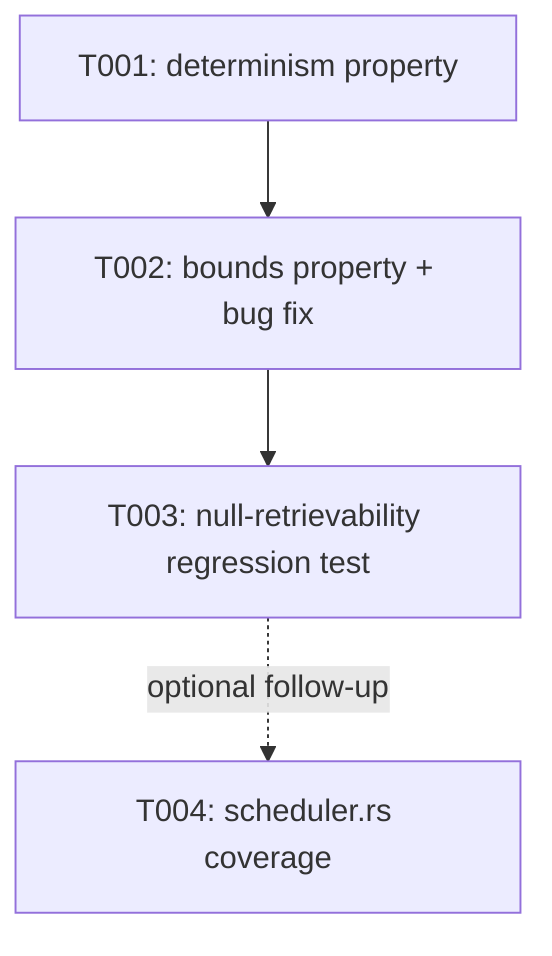

---
aliases:
  - FSRS Proptest Coverage Tasks
tags:
  - sdd
  - tasks
  - testing
  - learning-scheduler
  - status/implemented
created: 2026-08-09
status: implemented
related:
  - "[[spec]]"
  - "[[plan]]"
---

# Implementation Tasks: FSRS Scheduler Property-Based Test Coverage Gap (Retroactive)

> [!info] References
> **Spec**: [[spec]]
> **Plan**: [[plan]]
> **Total tasks**: 3 completed (commit `33bdaa1`), 1 recommended follow-up
> (not scheduled)
>
> This is a retroactive breakdown of work already merged, reconstructed from
> the diff for traceability — not a forward-looking plan that was followed
> during implementation.

## Progress

- [x] T001: Add FSRS state-transition determinism property test
- [x] T002: Add FSRS bounds property test and fix the sign bug it found
- [x] T003: Add regression test for `null`-retrievability self-heal
- [ ] T004 (follow-up, not scheduled): Add `scheduler.rs` property coverage

---

## Dependency Graph

---

### T001: Add FSRS State-Transition Determinism Property Test

**Context**: Establish that `PerformanceTracker::record_attempt` is
deterministic for a given rating sequence and clock, closing part of the
gap between `.claude/rules/continuous-improvement.md`'s claim and actual
coverage.
**Spec reference**: [[spec#FR-003]]
**Acceptance criteria**:
- [x] `prop_fsrs_state_transition_is_deterministic` added to
      `src/learning/performance.rs`'s `#[cfg(test)] mod tests`
- [x] Uses a fixed `FakeClock`, never live `Utc::now()`
- [x] Asserts equality of `stability`, `difficulty`, `state`, `reps`,
      `lapses`, `scheduled_days`, `due`, `retrievability` across two
      independently constructed trackers given the same input sequence
**Dependencies**: none
**Files**: `src/learning/performance.rs`
**Complexity**: low

---

### T002: Add FSRS Bounds Property Test (Found and Fixed a Real Bug)

**Context**: Verify `stability`/`difficulty`/`retrievability` stay within
their FSRS-defined valid domains across arbitrary generated attempt
sequences. Running this property surfaced a real defect.
**Spec reference**: [[spec#FR-001]]
**Acceptance criteria**:
- [x] `prop_fsrs_state_stays_in_bounds` added, asserting
      `difficulty ∈ [1.0, 10.0]`, `stability > 0.0`,
      `retrievability ∈ [0.0, 1.0]` after every simulated attempt
- [x] Bug found: `update_fsrs_state` passed a hardcoded `-0.5` decay to
      `fsrs::current_retrievability` instead of `fsrs::DEFAULT_PARAMETERS[20]`,
      producing NaN retrievability under some generated inputs
- [x] Fix: hoist `const FSRS_PARAMS: [f32; 21] = fsrs::DEFAULT_PARAMETERS;`
      and read `FSRS_PARAMS[20]`, applied at both `FSRS::new()` call sites
**Dependencies**: T001 (shares the fixed-clock test infrastructure)
**Files**: `src/learning/performance.rs`
**Complexity**: medium (bug diagnosis + fix, not just test authoring)

---

### T003: Add Regression Test for `null`-Retrievability Self-Heal

**Context**: The NaN bug found in T002 meant any already-affected user's
`profile.json` would have `retrievability: null` on disk and fail to
deserialize entirely. A custom deserializer was added so such files
self-heal instead of hard-failing; this task locks that behavior in.
**Spec reference**: [[BRD#Bug Found By This Work]]
**Acceptance criteria**:
- [x] Custom `deserialize_retrievability` deserializer added
      (`Option<f32>` → `unwrap_or(1.0)`)
- [x] `test_deserialize_null_retrievability_recovers_as_one` added and
      passing
**Dependencies**: T002
**Files**: `src/learning/performance.rs`
**Complexity**: low

---

### T004 (Follow-up, Not Scheduled): Add `scheduler.rs` Property Coverage

**Context**: `src/learning/scheduler.rs` (`ReviewItem` ordering,
`get_due_reviews`/`get_review_queue`) remains completely uncovered by
proptest, per [[plan#Residual Work]]. This task is recorded for
traceability but was **not** part of commit `33bdaa1` and has no assigned
owner or timeline.
**Spec reference**: [[spec#FR-004]], [[spec#FR-005]]
**Acceptance criteria**:
- [ ] Property test asserting `ReviewItem`'s `Ord`/`PartialOrd` is total,
      transitive, and panic-free across arbitrary `priority` values
      including edge-case floats
- [ ] Property test asserting `get_due_reviews`/`get_review_queue` only
      return items with `due <= now` and never exceed the requested size
      limit, across arbitrarily generated tracked-command sets
- [ ] Both use a fixed clock, consistent with `performance.rs`'s convention
**Dependencies**: none (independent of T001-T003; same subsystem)
**Files**: `src/learning/scheduler.rs`
**Complexity**: low-medium

---

## Implementation Notes

### Order of execution
T001 → T002 → T003 is the order reconstructed from the commit's internal
logic (write the determinism property first since it reuses the simplest
harness, then the bounds property which surfaced the bug, then the
regression test locking in the fix). T004 is independent and can be
picked up separately at any time.

### Common patterns
Follow `performance.rs`'s established pattern: inline tuple/range
`proptest` strategies (no `prop_compose!` needed for this shape),
`FakeClock` for determinism, colocated in the existing `#[cfg(test)] mod
tests` block.

### Gotchas
- Do not read `Utc::now()` inside any new property test body — use
  `FakeClock` per NFR-003.
- If T004 is picked up, `ReviewItem`'s existing `total_cmp`-based `Ord`
  should be property-tested as-is first before considering any redesign —
  the pre-existing implementation is believed correct, coverage is the gap,
  not the algorithm.

## See Also

- [[spec]] — feature specification (retroactive)
- [[plan]] — as-built architecture and residual work
- [[BRD]] — business rationale
- [[MOC-specs]] — all specifications
