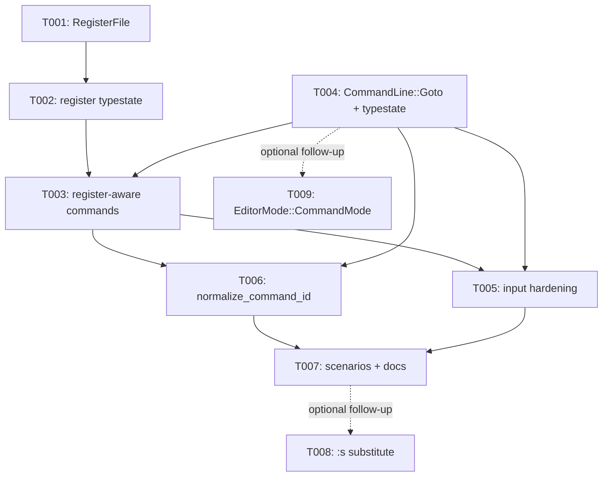

---
aliases:
  - Register and Command-Line Mode Tasks
tags:
  - sdd
  - tasks
  - helix-simulator
  - input-system
  - status/implemented
created: 2026-08-09
status: implemented
related:
  - "[[spec]]"
  - "[[plan]]"
---

# Implementation Tasks: Named Register and Command-Line Mode Support (Retroactive)

> [!info] References
> **Spec**: [[spec]]
> **Plan**: [[plan]]
> **Total tasks**: 7 completed (commit `1ba668d`), 2 recommended follow-ups
> (not scheduled)
>
> Retroactive breakdown reconstructed from the diff for traceability.

## Progress

- [x] T001: Add `RegisterFile` and generalize simulator clipboard state
- [x] T002: Add register-selection typestate (`RegisterPending`, `RegisterOpPending`)
- [x] T003: Wire register-aware yank/paste/replace commands
- [x] T004: Add `CommandLine::Goto` and `CommandLinePending` typestate
- [x] T005: Harden input dispatch (multi-byte register chars, Alt/Ctrl fallthrough, arcade Esc)
- [x] T006: Add `normalize_command_id` for FSRS/quest tracking
- [x] T007: Add scenario coverage and update `docs/HELIX_KEYBINDINGS.md`
- [ ] T008 (follow-up, not scheduled): Implement `:s` substitute
- [ ] T009 (follow-up, not scheduled): Extend `EditorMode` with a real `CommandMode` variant

---

## Dependency Graph

---

### T001: Add `RegisterFile` and Generalize Simulator Clipboard State

**Context**: Foundation for named registers — replace the single
`clipboard: Option<String>` field with a real named-storage map, without
duplicating structure.
**Spec reference**: [[spec#FR-004]]
**Acceptance criteria**:
- [x] `RegisterFile` (`HashMap<char, String>`, `UNNAMED_REGISTER = '"'`)
      added to `src/helix/simulator/register_file.rs`
- [x] `HelixSimulator.clipboard` renamed/replaced with
      `registers: RegisterFile`
- [x] Existing default-clipboard tests pass unmodified aside from the
      field rename
**Dependencies**: none
**Files**: `src/helix/simulator/register_file.rs`, `src/helix/simulator/mod.rs`
**Complexity**: low

---

### T002: Add Register-Selection Typestate

**Context**: `"` and `"<reg>` need pending-input states consistent with
the existing `GotoPending`/`ViewPending`/`MatchPending` pattern.
**Spec reference**: [[spec#FR-001]]
**Acceptance criteria**:
- [x] `RegisterPending` (after `"`) and `RegisterOpPending { register:
      char }` (after `"<reg>`) added to `InputState`/`state_types.rs`
- [x] Invalid register-name characters route to `UserError` and return to
      `BaseState`
**Dependencies**: T001
**Files**: `src/input/typestate/input_state.rs`, `state_types.rs`, `handlers/register.rs`
**Complexity**: medium

---

### T003: Wire Register-Aware Yank/Paste/Replace Commands

**Context**: Connect the register-selection typestate to real
yank/paste/replace behavior against `RegisterFile`.
**Spec reference**: [[spec#FR-002]], [[spec#FR-003]]
**Acceptance criteria**:
- [x] `"<reg>y` yanks into the named register
- [x] `"<reg>p`/`"<reg>P` paste from the named register after/before cursor
- [x] `"<reg>R` (extension beyond the draft) replaces with the named
      register's content
- [x] Any other key after `"<reg>` cancels the pending state
**Dependencies**: T001, T002
**Files**: `src/helix/simulator/commands/clipboard.rs`, `commands/mod.rs`
**Complexity**: medium

---

### T004: Add `CommandLine::Goto` and `CommandLinePending` Typestate

**Context**: Deliver a reachable command-line prompt, scoped to
goto-line-N navigation after evaluating and dropping `:s`/`:g`-global/
`:sort`/`:clear-register` as not verifiable against the snapshot-based
scenario completion model.
**Spec reference**: [[spec#FR-005]], [[spec#FR-007]], [[spec#FR-008]]
**Acceptance criteria**:
- [x] `:` enters `CommandLinePending { buffer }`
- [x] `CommandLine::Goto(usize)` parses `:N`, `:goto N`, `:g N`
- [x] Enter on valid input applies the goto and returns to Normal mode
- [x] Escape discards input, no document mutation
- [x] Malformed input converts to `Cancel` via intercepted `UserError`,
      not a propagated panic-risking error
- [x] `security::limits::MAX_COMMAND_LINE_LEN = 256` bounds buffer growth
**Dependencies**: none (parallel to T001-T003)
**Files**: `src/helix/simulator/command_line.rs`, `src/input/typestate/handlers/command_line.rs`, `src/security.rs`
**Complexity**: medium
**Note**: `EditorMode` was deliberately not extended — see [[plan#Key Design Decisions]]. `:s` substitute (FR-006) was **not** implemented — see T008.

---

### T005: Harden Input Dispatch

**Context**: Building register/command-line handling surfaced adjacent
input-robustness defects, fixed in the same commit rather than deferred.
**Spec reference**: not drafted — discovered during implementation, see [[NFR#6. Unanticipated Finding]]
**Acceptance criteria**:
- [x] Multi-byte/non-ASCII register-name characters no longer panic
      (`chars()` used instead of byte-length/`.nth()` indexing)
- [x] Unmapped Alt/Ctrl key combinations no longer fall through as
      bare-char commands
- [x] Arcade-mode Esc cancels pending register/command-line/prefix state
      instead of unconditionally pausing; input state resets between
      arcade scenarios
**Dependencies**: T002, T004
**Files**: `src/input/typestate/handlers/base.rs`, `keytrie.rs`, `handlers.rs`
**Complexity**: medium

---

### T006: Add `normalize_command_id` for FSRS/Quest Tracking

**Context**: Register letters and command-line invocations need to
collapse to stable, trackable FSRS/quest command IDs rather than one ID
per raw string permutation.
**Spec reference**: [[spec#FR-010]]
**Acceptance criteria**:
- [x] `normalize_command_id()` added to `src/helix/commands.rs`,
      canonicalizing e.g. `"ay` → `"y`, `:g 3` → `:goto`
- [x] Wired at 3 call sites: `scenario_completion.rs:163`,
      `minigame/session.rs:848`, `ui/state/handlers/quests.rs:21`
- [x] Regression test confirms consistent normalization
**Dependencies**: T003, T004
**Files**: `src/helix/commands.rs`, `src/minigame/session.rs`, `src/ui/state/handlers/quests.rs`
**Complexity**: low

---

### T007: Add Scenario Coverage and Update Documentation

**Context**: Ground both new capabilities in playable, FSRS-trackable
content and disclose the goto-only command-line scope to users.
**Spec reference**: [[spec#FR-009]], [[spec#US-003]]
**Acceptance criteria**:
- [x] `ScenarioCategory::Registers` added
- [x] `scenarios/en/registers/named-registers.toml` (1 scenario) added
- [x] `scenarios/en/movement/command-line-goto.toml` (1 scenario) added
- [x] Both pass `cargo nextest run scenario`
- [x] `docs/HELIX_KEYBINDINGS.md` updated with explicit "❌ everything
      else" disclaimer for the command-line surface
**Dependencies**: T005, T006
**Files**: `src/config/scenarios.rs`, `scenarios/en/registers/`, `scenarios/en/movement/`, `docs/HELIX_KEYBINDINGS.md`
**Complexity**: low

---

### T008 (Follow-up, Not Scheduled): Implement `:s` Substitute

**Context**: The original US-002/FR-006 goal — search-and-replace via
`:s/pattern/replacement/` — remains fully unimplemented. Only goto
navigation shipped.
**Spec reference**: [[spec#FR-006]], [[BRD#Open Questions]]
**Acceptance criteria**:
- [ ] `CommandLine` gains a `Substitute { pattern, replacement, scope }`
      variant (or equivalent)
- [ ] Scope semantics (current line/selection/whole document) resolved
      against real Helix behavior before implementation, not assumed
- [ ] Compatible with the snapshot-based scenario completion model, or an
      explicit design note on how it becomes verifiable (the reason this
      was dropped from the original scope)
- [ ] Malformed regex surfaces `UserError`, does not modify the document
**Dependencies**: T004 (extends the existing `CommandLine` type)
**Files**: `src/helix/simulator/command_line.rs`, `src/input/typestate/handlers/command_line.rs`
**Complexity**: high

---

### T009 (Follow-up, Not Scheduled): Extend `EditorMode` with a Real `CommandMode` Variant

**Context**: Close the NFR-002 architectural gap — command-line state
currently lives only in the input-typestate layer, not in the simulator's
own sealed-trait mode type.
**Spec reference**: [[spec#FR-005]], [[NFR#NFR-002]]
**Acceptance criteria**:
- [ ] `EditorMode` gains a `CommandMode` variant following the existing
      sealed-trait pattern
- [ ] `CommandLinePending` (input layer) and `EditorMode::CommandMode`
      (simulator layer) are reconciled — either the input state drives the
      simulator mode, or a maintainer decision is recorded that this is
      unnecessary
**Dependencies**: T004
**Files**: `src/helix/simulator/mode.rs`
**Complexity**: medium — mostly a modeling exercise, low runtime-behavior risk

---

## Implementation Notes

### Order of execution
T001 → T002 → T003 (registers) can proceed in parallel with T004
(command-line, independent subsystem) before both converge at T005-T007.
T008/T009 are independent follow-ups with no forced ordering between them.

### Common patterns
Follow the established typestate pattern (`state_types.rs` marker structs +
`HandlerState`/`Sealed`); route all failure modes through `UserError`;
prefer canonicalization functions over `src/learning/`-side lookup tables
for command-ID mapping, per T006's precedent.

### Gotchas
- Do not assume `:` implies `EditorMode::CommandMode` exists — it does not
  (see T004's note and [[NFR#NFR-002]]). Any code checking `EditorMode`
  will not see command-line state.
- Register-name character handling must use `chars()`, not byte length or
  `.nth()` — multi-byte input caused real panics before T005.
- If T008 is picked up, resolve the "not verifiable against snapshot-based
  completion" constraint from T004 first — it is the reason `:s` was
  dropped, not merely deferred for time.

## See Also

- [[spec]] — feature specification (retroactive)
- [[plan]] — as-built architecture and residual work
- [[BRD]] — business rationale
- [[MOC-specs]] — all specifications
